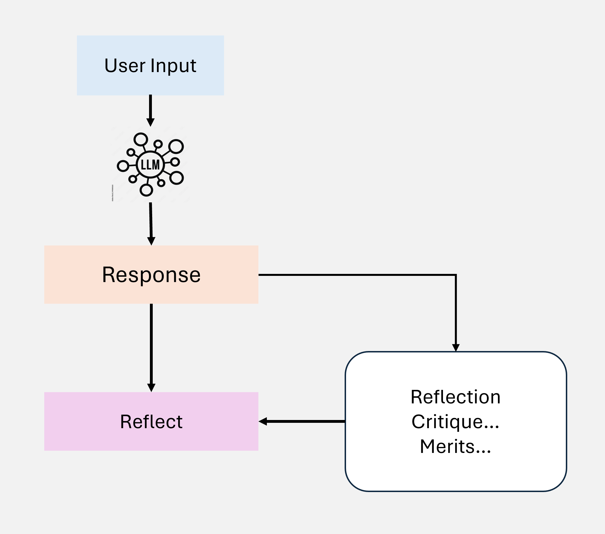
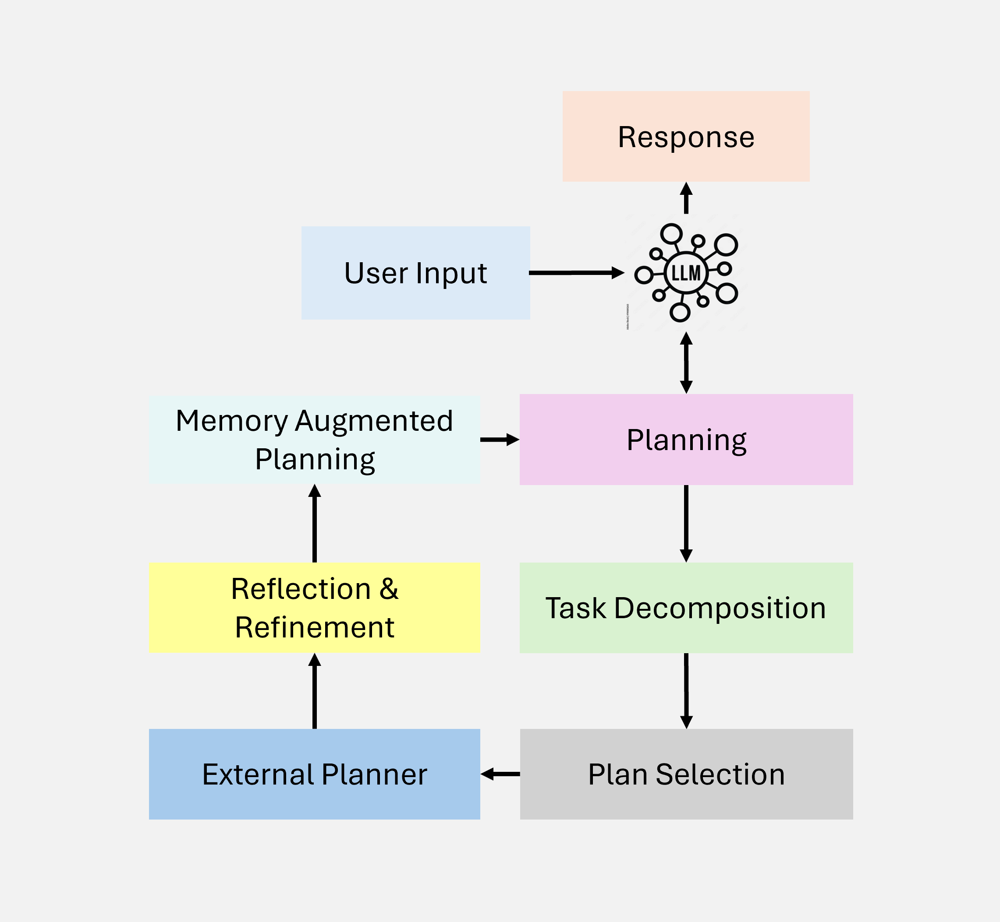
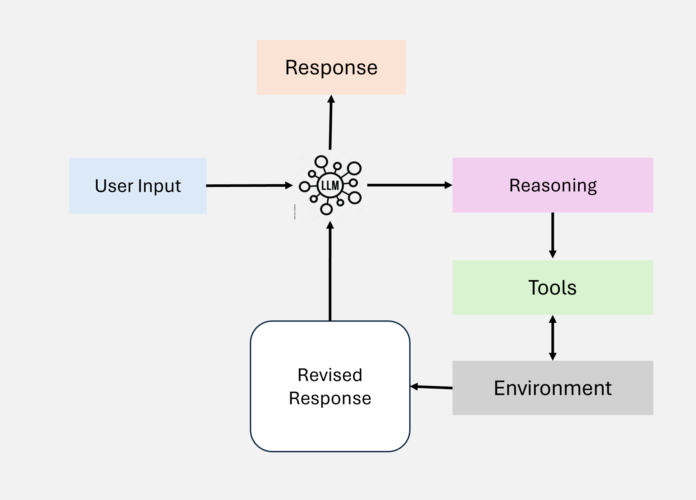
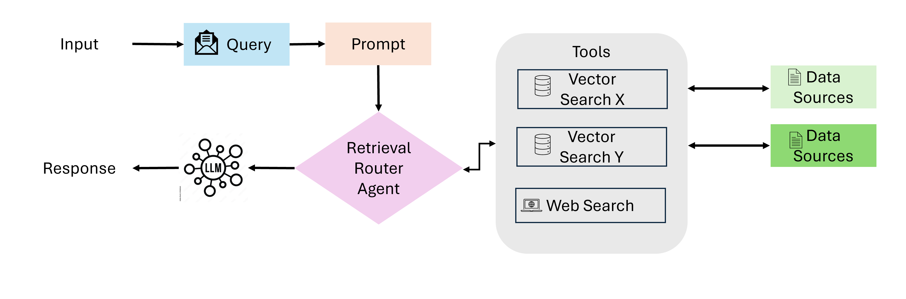
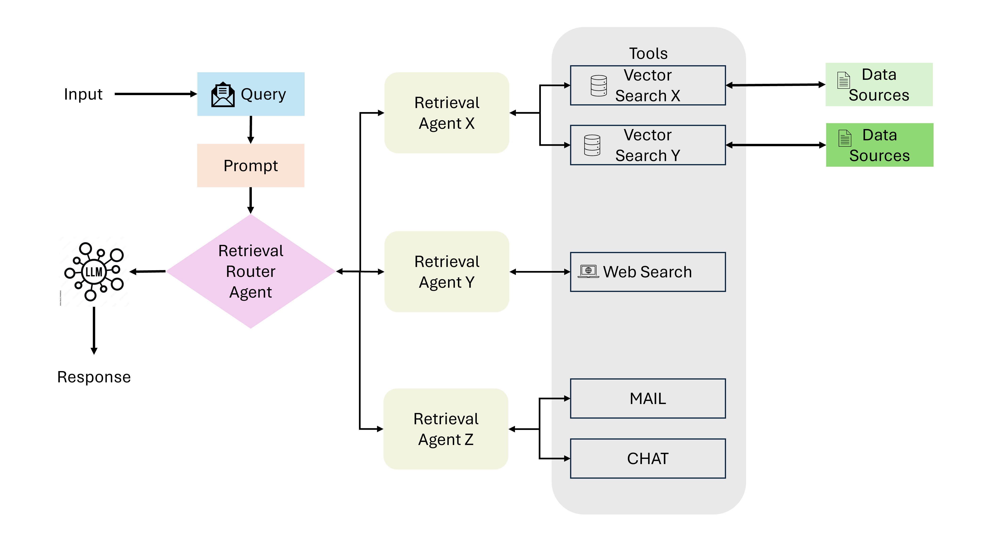

# Agentic Retrieval-Augmented Generation (RAG): A Comprehensive Survey

This repository accompanies the paper "Agentic Retrieval-Augmented Generation (RAG): A Comprehensive Survey," providing supplementary materials, visualizations, and insights into the taxonomy, applications, and challenges of Agentic RAG systems. The goal is to facilitate understanding and adoption of these advanced paradigms by researchers and practitioners.

---

## Abstract

Agentic Retrieval-Augmented Generation (RAG) represents a transformative leap in artificial intelligence by embedding autonomous agents into the RAG pipeline. This repository complements the survey paper "Agentic Retrieval-Augmented Generation (RAG): A Comprehensive Survey," providing insights into:

- Foundational principles, including **Agentic Patterns** such as reflection, planning, tool use, and multi-agent collaboration.
- A detailed taxonomy of Agentic RAG systems, showcasing frameworks like single-agent, multi-agent, hierarchical, corrective, adaptive, and graph-based RAG.
- Comparative analysis of traditional RAG, Agentic RAG, and Agentic Document Workflows (ADW) to highlight their strengths, weaknesses, and best-fit scenarios.
- Real-world applications across industries like healthcare, education, finance, and legal analysis.
- Challenges and future directions in scaling, ethical AI, multimodal integration, and human-agent collaboration.

This repository serves as a comprehensive resource for researchers and practitioners to explore, implement, and advance the capabilities of Agentic RAG systems.

---

## Table of Contents
1. 📜 [Abstract](#abstract)
2. 🧩 [Introduction](#introduction)
3. 🤖 [Agentic Patterns](#agentic-patterns-in-retrieval-augmented-generation)
4. 🛠️ [Taxonomy of Agentic RAG Systems](#taxonomy-of-agentic-rag-systems)
5. 🔍 [Comparative Analysis of Agentic RAG Frameworks](#comparative-analysis-of-agentic-rag-frameworks)
6. 💼 [Applications](#applications)
7. 🚧 [Challenges and Future Directions](#challenges-and-future-directions)
8. 📚 [References](#references)
9. 🖊️ [How to Cite](#how-to-cite)
10. 📞 [Contact Information](#contact-information)
11. 📜 [License](#license)

---

## Introduction

Retrieval-Augmented Generation (RAG) systems combine the capabilities of large language models (LLMs) with retrieval mechanisms to generate contextually relevant and accurate responses. While traditional RAG systems excel in knowledge retrieval and generation, they often fall short in handling dynamic, multi-step reasoning tasks, adaptability, and orchestration for complex workflows.

**Agentic Retrieval-Augmented Generation (Agentic RAG)** overcomes these limitations by integrating autonomous AI agents. These agents employ core **Agentic Patterns**, such as reflection, planning, tool use, and multi-agent collaboration, to dynamically adapt to task-specific requirements and provide superior performance in:

- Multi-domain knowledge retrieval.
- Real-time, document-centric workflows.
- Scalable, adaptive, and ethical AI systems.

This repository explores the evolution of RAG to Agentic RAG, presenting:
- **Agentic Patterns**: The core principles driving the system’s adaptability and intelligence.
- **Taxonomy**: A comprehensive classification of Agentic RAG architectures.
- **Comparative Analysis**: Key differences between Traditional RAG, Agentic RAG, and ADW.
- **Applications**: Practical use cases across healthcare, education, finance, and more.
- **Challenges and Future Directions**: Addressing scalability, ethical AI, and multimodal integration.

Whether you’re a researcher, developer, or practitioner, this repository offers valuable insights and resources to understand and advance Agentic RAG systems.

---

## Agentic Patterns in Retrieval-Augmented Generation

Agentic RAG systems derive their intelligence and adaptability from well-defined agentic patterns. These patterns enable agents to handle complex reasoning tasks, adapt to dynamic environments, and collaborate effectively. Below are the key patterns central to Agentic RAG:

### 1. Reflection
- **Definition**: Agents evaluate their own decisions and outputs, identifying errors and areas for improvement.
- **Key Benefits**:
  - Enables iterative refinement of results.
  - Enhances accuracy in multi-step reasoning tasks.
- **Example**: In a medical diagnostic system, agents refine diagnoses based on iterative feedback from retrieved data.

<div style="border: 1px solid #ddd; padding: 10px; background-color: white; display: inline-block; text-align: left; margin: 10px; width: 300px;">
  
  <p><em>Figure 1: Reflection Pattern</em></p>
</div>


<br><br>

### 2. Planning
- **Definition**: Agents create structured workflows and task sequences to solve problems efficiently.
- **Key Benefits**:
  - Facilitates multi-step reasoning by breaking down tasks.
  - Reduces computational overhead through optimized task prioritization.
- **Example**: A financial analysis system plans data retrieval tasks to assess risks and provide recommendations.

<div style="border: 1px solid #ddd; padding: 10px; background-color: white; display: inline-block; text-align: left; margin: 10px; width: 300px;">
  
  <p><em>Figure 2: Planning Pattern</em></p>
</div>


<br><br>

### 3. Tool Use
- **Definition**: Agents interact with external tools, APIs, and knowledge bases to retrieve and process data.
- **Key Benefits**:
  - Expands the system's capabilities beyond pre-trained knowledge.
  - Enables domain-specific applications by integrating external resources.
- **Example**: A legal assistant agent retrieves clauses from contract databases and applies domain-specific rules for compliance analysis.

<div style="border: 1px solid #ddd; padding: 10px; background-color: white; display: inline-block; text-align: left; margin: 10px; width: 300px;">
  
  <p><em>Figure 3: Tool Use Pattern</em></p>
</div>

<br><br>

### 4. Multi-Agent Collaboration
- **Definition**: Multiple agents collaborate to divide and conquer complex tasks, sharing information and results.
- **Key Benefits**:
  - Handles large-scale and distributed problems efficiently.
  - Combines specialized agent capabilities for better outcomes.
- **Example**: In customer support, agents collaborate to retrieve knowledge from FAQs, generate responses, and provide follow-ups.

<div style="border: 1px solid #ddd; padding: 10px; background-color: white; display: inline-block; text-align: left; margin: 10px; width: 200px;">
  
  <p><em>Figure 4: Multi-Agent Collaboration Pattern</em></p>
</div>


---

### Significance of Agentic Patterns
These patterns form the backbone of Agentic RAG systems, enabling them to:
- Adapt dynamically to task requirements.
- Improve decision-making through self-evaluation.
- Leverage external resources for domain-specific reasoning.
- Handle complex, distributed workflows via collaboration.

---

## Taxonomy of Agentic RAG Systems

Agentic Retrieval-Augmented Generation (RAG) systems encompass various architectures and workflows, each tailored to specific tasks and levels of complexity. Below is a detailed taxonomy of these systems:

### 1. Single-Agent RAG
- **Key Idea**: A single autonomous agent manages the retrieval and generation process.
- **Workflow**:
  1. Query is submitted to the agent.
  2. The agent retrieves relevant data from external sources.
  3. Data is processed and synthesized into a response.
- **Advantages**:
  - Simple architecture for basic use cases.
  - Easy to implement and maintain.
- **Limitations**:
  - Limited scalability.
  - Ineffective for multi-step reasoning or large datasets.

### 2. Multi-Agent RAG
- **Key Idea**: A team of agents collaborates to perform complex retrieval and reasoning tasks.
- **Workflow**:
  1. Agents dynamically divide tasks (e.g., retrieval, reasoning, synthesis).
  2. Each agent specializes in a specific sub-task.
  3. Results are aggregated and synthesized into a coherent output.
- **Advantages**:
  - Better performance for distributed, multi-step tasks.
  - Increased modularity and scalability.
- **Limitations**:
  - Coordination complexity increases with the number of agents.
  - Risk of redundancy or conflicts between agents.

### 3. Hierarchical Agentic RAG
- **Key Idea**: Organizes agents in a hierarchy for better task prioritization and delegation.
- **Workflow**:
  1. A top-level agent orchestrates subtasks among lower-level agents.
  2. Each lower-level agent handles a specific part of the process.
  3. Results are iteratively refined and integrated at higher levels.
- **Advantages**:
  - Scalable for large and complex tasks.
  - Modular design facilitates specialization.
- **Limitations**:
  - Requires sophisticated orchestration mechanisms.
  - Potential bottlenecks at higher levels of the hierarchy.

### 4. Corrective Agentic RAG
- **Key Idea**: Feedback loops enable agents to evaluate and refine their outputs iteratively.
- **Workflow**:
  1. Initial response is generated by the agent.
  2. A critic module evaluates the response for errors or inconsistencies.
  3. The agent refines the response based on feedback.
  4. Steps 2-3 repeat until the output meets quality standards.
- **Advantages**:
  - High accuracy and reliability through iterative improvements.
  - Useful for error-prone or high-stakes tasks.
- **Limitations**:
  - Increased computational overhead.
  - Feedback mechanisms must be well-designed to avoid infinite loops.

### 5. Adaptive Agentic RAG
- **Key Idea**: Dynamically adjusts retrieval strategies and workflows based on task requirements.
- **Workflow**:
  1. The agent assesses the query and its context.
  2. Adapts retrieval strategies in real-time based on available data and user needs.
  3. Synthesizes a response using dynamic workflows.
- **Advantages**:
  - High flexibility for varied tasks and dynamic environments.
  - Improves context relevance and user satisfaction.
- **Limitations**:
  - Challenging to design robust adaptation mechanisms.
  - Computational overhead for real-time adjustments.

### 6. Graph-Based Agentic RAG
Graph-based RAG systems extend traditional RAG by integrating graph-based data structures for advanced reasoning.

#### 6.1 Agent-G: Agentic Framework for Graph RAG
- **Key Idea**: Dynamically assigns tasks to specialized agents using graph knowledge bases and feedback loops.
- **Workflow**:
  1. Extract relationships from graph knowledge bases (e.g., disease-to-symptom mappings).
  2. Complement with unstructured data from external sources.
  3. Use a critic module to validate results and iteratively improve.
- **Advantages**:
  - Combines structured and unstructured data.
  - Modular and scalable for complex tasks.
  - Ensures high accuracy through iterative refinement.

#### 6.2 GeAR: Graph-Enhanced Agent for RAG
- **Key Idea**: Enhances RAG systems with graph expansion techniques and agent-based architectures.
- **Workflow**:
  1. Expand query-related graphs for better relational understanding.
  2. Leverage specialized agents for multi-hop reasoning.
  3. Synthesize graph-structured and unstructured information into responses.
- **Advantages**:
  - Excels in multi-hop reasoning scenarios.
  - Improves accuracy for deep contextual tasks.
  - Dynamically adapts to complex query environments.

### 7. Agentic Document Workflows (ADW)

Agentic Document Workflows (ADW) extend traditional RAG systems by automating document-centric processes with intelligent agents.

#### Workflow
1. **Document Parsing and Structuring**:
   - Extracts structured data from documents like invoices or contracts.
2. **State Maintenance**:
   - Tracks context across multi-step workflows for consistency.
3. **Knowledge Retrieval**:
   - Retrieves relevant references from external sources or domain-specific databases.
4. **Agentic Orchestration**:
   - Applies business rules, performs multi-hop reasoning, and orchestrates external APIs.
5. **Actionable Output Generation**:
   - Produces structured outputs tailored to specific use cases (e.g., reports or summaries).

#### Key Features and Advantages
- **State Maintenance**: Ensures consistency in multi-step workflows.
- **Domain-Specific Intelligence**: Adapts to specialized domains with tailored rules.
- **Scalability**: Handles large-scale document processing efficiently.
- **Enhanced Productivity**: Reduces manual effort and augments human expertise.

---

### Visual Representations

<div style="border: 1px solid #ddd; padding: 10px; background-color: white; display: inline-block; margin: 10px; width: 200px; text-align: center;">
  
  <p align="left"><em>Figure 5: Single-Agent RAG Diagram</em></p>
</div>

<div style="border: 1px solid #ddd; padding: 10px; background-color: white; display: inline-block; margin: 10px; width: 200px; text-align: center;">
  
  <p align="left"><em>Figure 6: Multi-Agent RAG Diagram</em></p>
</div>

<div style="border: 1px solid #ddd; padding: 10px; background-color: white; display: inline-block; margin: 10px; width: 200px; text-align: center;">
  
  <p align="left"><em>Figure 7: Hierarchical RAG Workflow</em></p>
</div>

<div style="border: 1px solid #ddd; padding: 10px; background-color: white; display: inline-block; margin: 10px; width: 200px; text-align: center;">
  
  <p align="left"><em>Figure 8: Graph-Based RAG Workflow</em></p>
</div>

<div style="border: 1px solid #ddd; padding: 10px; background-color: white; display: inline-block; margin: 10px; width: 200px; text-align: center;">
  
  <p align="left"><em>Figure 9: ADW Workflow Diagram</em></p>
</div>

---

## Comparative Analysis of Agentic RAG Frameworks

The table below provides a comprehensive comparative analysis of the three architectural frameworks: Traditional RAG, Agentic RAG, and Agentic Document Workflows (ADW). This analysis highlights their respective strengths, weaknesses, and best-fit scenarios, offering valuable insights into their applicability across diverse use cases.

| **Feature**                | **Traditional RAG**               | **Agentic RAG**                        | **Agentic Document Workflows (ADW)**  |
|----------------------------|-----------------------------------|----------------------------------------|----------------------------------------|
| **Focus**                  | Isolated retrieval and generation tasks | Multi-agent collaboration and reasoning | Document-centric end-to-end workflows |
| **Context Maintenance**    | Limited                          | Enabled through memory modules         | Maintains state across multi-step workflows |
| **Dynamic Adaptability**   | Minimal                          | High                                   | Tailored to document workflows         |
| **Workflow Orchestration** | Absent                           | Orchestrates multi-agent tasks         | Integrates multi-step document processing |
| **Use of External Tools/APIs** | Basic integration (e.g., retrieval tools) | Extends via tools like APIs and knowledge bases | Deeply integrates business rules and domain-specific tools |
| **Scalability**            | Limited to small datasets or queries | Scalable for multi-agent systems       | Scales for multi-domain enterprise workflows |
| **Complex Reasoning**      | Basic (e.g., simple Q&A)          | Multi-step reasoning with agents       | Structured reasoning across documents  |
| **Primary Applications**   | QA systems, knowledge retrieval   | Multi-domain knowledge and reasoning   | Contract review, invoice processing, claims analysis |
| **Strengths**              | Simplicity, quick setup           | High accuracy, collaborative reasoning | End-to-end automation, domain-specific intelligence |
| **Challenges**             | Poor contextual understanding     | Coordination complexity                | Resource overhead, domain standardization |

---

### Key Takeaways
- **Traditional RAG** is best suited for simpler tasks requiring basic retrieval and generation capabilities.
- **Agentic RAG** excels in multi-agent collaborative reasoning, making it suitable for more complex, multi-domain tasks.
- **Agentic Document Workflows (ADW)** provide tailored, document-centric solutions for enterprise-scale applications like contract analysis and invoice processing.

---

## Applications

Agentic Retrieval-Augmented Generation (RAG) systems have transformative potential across diverse industries, enabling intelligent retrieval, multi-step reasoning, and dynamic adaptation to complex tasks. Below are some key domains where Agentic RAG systems make a significant impact:

### 1. Healthcare and Personalized Medicine
- **Problem**: Rapid retrieval and synthesis of medical knowledge for diagnostics, treatment planning, and research.
- **Applications**:
  - Clinical decision support systems leveraging multi-modal data (e.g., patient records, medical literature).
  - Automating medical report generation with relevant contextual references.
  - Multi-hop reasoning for analyzing complex relationships (e.g., disease-to-symptom mappings or treatment-to-outcome correlations).

### 2. Education and Personalized Learning
- **Problem**: Delivering personalized and adaptive learning experiences for diverse learners.
- **Applications**:
  - Designing intelligent tutors capable of real-time knowledge retrieval and personalized feedback.
  - Generating customized educational content based on student progress and preferences.
  - Multi-agent systems for collaborative learning simulations.

### 3. Legal and Contract Analysis
- **Problem**: Analyzing complex legal documents and extracting actionable insights.
- **Applications**:
  - Contract summarization and clause comparison with contextual alignment to legal standards.
  - Retrieval of precedent cases and regulatory guidelines for compliance.
  - Iterative workflows for identifying inconsistencies or conflicts in contracts.

### 4. Finance and Risk Analysis
- **Problem**: Analyzing large-scale financial datasets and identifying trends, risks, and opportunities.
- **Applications**:
  - Automating the generation of financial summaries and investment recommendations.
  - Real-time fraud detection through multi-step reasoning and data correlation.
  - Scenario-based modeling for risk analysis using graph-based workflows.

### 5. Customer Support and Virtual Assistants
- **Problem**: Providing contextually relevant and dynamic responses to customer queries.
- **Applications**:
  - Building AI-powered virtual assistants for real-time customer support.
  - Adaptive systems that improve responses by learning from user feedback.
  - Multi-agent orchestration for handling complex, multi-query interactions.

### 6. Graph-Enhanced Applications in Multimodal Workflows
- **Problem**: Tackling tasks requiring relational understanding and multi-modal data integration.
- **Applications**:
  - Graph-based retrieval systems for connecting structured and unstructured data.
  - Enhanced reasoning workflows in domains like scientific research and knowledge management.
  - Synthesis of insights across text, images, and structured data for actionable outputs.

### 7. Document-Centric Workflows
- **Problem**: Automating complex workflows involving document parsing, data extraction, and multi-step reasoning.
- **Applications**:
  - **Invoice Payments Workflow**:
    - Parses invoices to extract key details (e.g., invoice number, vendor info, payment terms).
    - Retrieves related vendor contracts to verify terms and compliance.
    - Generates a payment recommendation report, including cost-saving suggestions (e.g., early payment discounts).
  - **Contract Review**:
    - Analyzes legal contracts for critical clauses and compliance issues.
    - Automatically identifies risks and provides actionable recommendations.
  - **Insurance Claims Analysis**:
    - Automates claims review, extracting policy terms and calculating payouts based on predefined rules.
- **Key Advantages**:
  - **State Maintenance**: Tracks the document’s context across workflow stages.
  - **Domain-Specific Intelligence**: Applies tailored rules for industry-specific needs.
  - **Scalability**: Handles large volumes of enterprise documents efficiently.
  - **Enhanced Productivity**: Reduces manual effort and augments human expertise.

---

## Challenges and Future Directions

While Agentic Retrieval-Augmented Generation (RAG) systems show immense promise, there are several challenges and research opportunities that remain unaddressed:

### Challenges
1. **Coordination Complexity in Multi-Agent Systems**:
   - Managing communication and collaboration among multiple agents can lead to inefficiencies and increased computational overhead.
   - Balancing task assignments and resolving conflicts between agents remains a critical issue.

2. **Ethical and Responsible AI**:
   - Ensuring unbiased retrieval and decision-making in sensitive domains like healthcare and finance.
   - Addressing data privacy concerns and building transparent systems that adhere to ethical standards.

3. **Scalability and Latency**:
   - Scaling Agentic RAG systems to handle large datasets and high-volume queries without compromising response times.
   - Addressing latency in multi-agent and graph-based workflows.

4. **Hybrid Human-Agent Collaboration**:
   - Designing systems that effectively integrate human oversight with autonomous agents for tasks requiring domain expertise.
   - Maintaining user trust and control while leveraging the strengths of AI agents.

5. **Expanding Multimodal Capabilities**:
   - Integrating text, image, audio, and video data for richer and more comprehensive outputs.
   - Handling the complexity of multimodal reasoning in real-time applications.

6. **Developing Specialized Benchmarks**:
   - The lack of standardized benchmarks for evaluating Agentic RAG systems across different domains.
   - Designing benchmarks that account for multi-hop reasoning, contextual understanding, and ethical considerations.

---

### Future Directions
1. **Enhanced Agentic Orchestration**:
   - Development of more robust coordination frameworks for hierarchical and multi-agent systems.
   - Incorporating adaptive learning mechanisms to dynamically improve task allocation.

2. **Domain-Specific Applications**:
   - Customizing Agentic RAG systems for niche domains like legal analysis, personalized education, and advanced scientific research.

3. **Ethical AI and Governance Frameworks**:
   - Building tools to monitor, explain, and mitigate biases in AI outputs.
   - Developing policies and guidelines for ethical deployment in high-stakes environments.

4. **Efficient Graph-Based Reasoning**:
   - Optimizing graph-based workflows for large-scale, real-world applications.
   - Exploring hybrid approaches that combine graph-based reasoning with neural networks.

5. **Human-AI Synergy**:
   - Designing intuitive interfaces and workflows to empower humans to interact effectively with Agentic RAG systems.
   - Focusing on explainability and user-centric design.

---


## References

### Research Papers on Agentic RAG 

#### 1. Single-Agent RAG (Router-Based)
- Search-o1: Agentic Search-Enhanced Large Reasoning Models https://arxiv.org/abs/2501.05366

#### 2. Multi-Agent Agentic RAG
- Agentic Retrieval-Augmented Generation for Time Series Analysis https://arxiv.org/abs/2408.14484

#### 3. Corrective Agentic RAG
- Agentic AI-Driven Technical Troubleshooting for Enterprise Systems https://arxiv.org/abs/2412.12006
- Corrective RAG (CRAG) https://langchain-ai.github.io/langgraph/tutorials/rag/langgraph_crag/
- Corrective Retrieval Augmented Generation https://arxiv.org/abs/2401.15884
- Agentic AI-Driven Technical Troubleshooting for Enterprise Systems https://arxiv.org/abs/2412.12006

#### 4. Adaptive Agentic RAG
- Langgraph Adaptive RAG https://langchain-ai.github.io/langgraph/tutorials/rag/langgraph_adaptive_rag/
- MBA-RAG: A Bandit Approach for Adaptive Retrieval-Augmented https://arxiv.org/abs/2412.01572
- CtrlA: Adaptive Retrieval-Augmented Generation via Inherent Control https://arxiv.org/abs/2405.18727
- Adaptive-RAG: Learning to Adapt Retrieval-Augmented Large Language Models through Question Complexity https://arxiv.org/abs/2403.14403
- AT-RAG: An Adaptive RAG Model Enhancing Query Efficiency with Topic Filtering and Iterative Reasoning https://arxiv.org/abs/2410.12886

#### 5. Graph-Based Agentic RAG
- GeAR: Graph-enhanced Agent for Retrieval-augmented Generation https://arxiv.org/abs/2412.18431
- Agent-G: An Agentic Framework for Graph Retrieval Augmented Generation https://openreview.net/forum?id=g2C947jjjQ

### Blogs and Tutorials on Agentic RAG
1. DeepLearning.AI. How agents can improve LLM performance. [DeepLearning.AI](https://www.deeplearning.ai/the-batch/how-agents-can-improve-llm-performance/?ref=dl-staging-website.ghost.io), 2024. Accessed: 2025-01-13.
2. Weaviate Blog. What is agentic RAG? [Weaviate Blog](https://weaviate.io/blog/what-is-agentic-rag#:~:text=is%20Agentic%20RAG%3F-,%E2%80%8B,of%20the%20non%2Dagentic%20pipeline), 2024. Accessed: 2025-01-14.
3. LangGraph CRAG Tutorial. LangGraph CRAG: Contextualized retrieval-augmented generation tutorial. [LangGraph CRAG](https://langchain-ai.github.io/langgraph/tutorials/rag/langgraph_crag/). Accessed: 2025-01-14.
4. LangGraph Adaptive RAG Tutorial. LangGraph adaptive RAG: Adaptive retrieval-augmented generation tutorial. [LangGraph Adaptive RAG](https://langchain-ai.github.io/langgraph/tutorials/rag/langgraph_adaptive_rag/). Accessed: 2025-01-14.
5. LlamaIndex Blog. Agentic RAG with LlamaIndex. [LlamaIndex Blog](https://www.llamaindex.ai/blog/agentic-rag-with-llamaindex-2721b8a49ff6). Accessed: 2025-01-14.
6. Hugging Face Cookbook. Agentic RAG: Turbocharge your retrieval-augmented generation with query reformulation and self-query. [Hugging Face Cookbook](https://huggingface.co/learn/cookbook/en/agent_rag). Accessed: 2025-01-14.
7. Qdrant Blog. Agentic RAG: Combining RAG with agents for enhanced information retrieval. [Qdrant Blog](https://qdrant.tech/articles/agentic-rag/). Accessed: 2025-01-14.

---

### Applications of Agentic RAG
1. AWS Machine Learning Blog. How Twitch used agentic workflow with RAG on Amazon Bedrock to supercharge ad sales. [AWS Machine Learning Blog](https://aws.amazon.com/blogs/machine-learning/how-twitch-used-agentic-workflow-with-rag-on-amazon-bedrock-to-supercharge-ad-sales/), 2025. Accessed: 2025-01-13.
2. LlamaCloud Demo Repository. Patient case summary workflow using LlamaCloud. [GitHub](https://github.com/run-llama/llamacloud-demo/blob/main/examples/document_workflows/patient_case_summary/patient_case_summary.ipynb), 2025. Accessed: 2025-01-13.
3. LlamaCloud Demo Repository. Contract review workflow using LlamaCloud. [GitHub](https://github.com/run-llama/llamacloud-demo/blob/main/examples/document_workflows/contract_review/contract_review.ipynb), 2025. Accessed: 2025-01-13.
4. LlamaCloud Demo Repository. Auto insurance claims workflow using LlamaCloud. [GitHub](https://github.com/run-llama/llamacloud-demo/blob/main/examples/document_workflows/auto_insurance_claims/auto_insurance_claims.ipynb), 2025. Accessed: 2025-01-13.
5. LlamaCloud Demo Repository. Research paper report generation workflow using LlamaCloud. [GitHub](https://github.com/run-llama/llamacloud-demo/blob/main/examples/report_generation/research_paper_report_generation.ipynb), 2025. Accessed: 2025-01-13.

---

### Tutorials and Frameworks
1. LangGraph Agentic RAG Tutorial. LangGraph agentic RAG: Nodes and edges tutorial. [LangGraph Tutorial](https://langchain-ai.github.io/langgraph/tutorials/rag/langgraph_agentic_rag/#nodes-and-edges). Accessed: 2025-01-14.
2. LlamaIndex Documentation. Agentic RAG using Vertex AI. [LlamaIndex Documentation](https://docs.llamaindex.ai/en/stable/examples/agent/agentic_rag_using_vertex_ai/). Accessed: 2025-01-14.
3. IBM Granite Community. Agentic RAG: AI agents with IBM Granite models. [GitHub](https://github.com/ibm-granite-community/granite-snack-cookbook/blob/main/recipes/AI-Agents/Agentic_RAG.ipynb). Accessed: 2025-01-14.

---

### Noteworthy Related Concepts
1. DeepLearning.AI. Self-refine: Iterative refinement with self-feedback. [DeepLearning.AI](https://www.deeplearning.ai). Accessed: 2025-01-13.
2. Reflexion: Language agents with verbal reinforcement learning, 2023. [GitHub](https://github.com). Accessed: 2025-01-14.


---

## How to Cite

If you find this work useful in your research, please cite:

```bibtex
@article{agenticRAG,
  title={Agentic Retrieval-Augmented Generation (RAG): A Comprehensive Survey},
  author={Your Name and Co-Authors},
  year={2024},
  journal={ArXiv},
  url={https://github.com/YourRepo/AgenticRAG-Survey}
}
